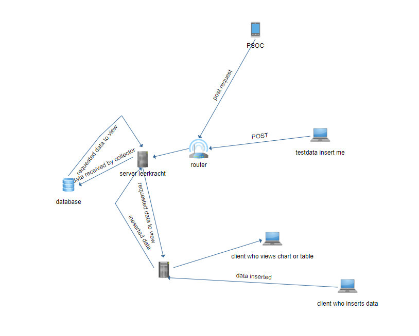

# iot
This is a project tp introduce people to iot. It receives data via an embeded device and stores it in a database. To view data, look at the table or chart. 

## link to project
[link](http://12001732.pxl-ea-ict.be/)

## flowchart 

